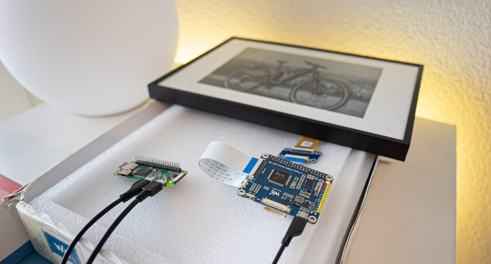

# IT8951 USB Treiber

Simpler USB-Treiber für ein IT8951 Kontroller. Getestet in diesem Fall mit einem E-Ink Display (10.3", 1872×1404) via USB an einem Raspberry Pi Zero W.

## Installation
Ausführbares File generieren
```
gcc -o it8951 main.c
```
## Ausführen

Hilfe / Argumentübersicht
```
./it8951 -h
```
Beispiel mit einem durch "ImageMagick" generierten Bild:
```
convert -background black -fill white -font Arial -pointsize 80 label:"123" -flip -gravity Center -extent 600x600 -depth 8 gray:- | ./it8951 -l -s -m 2 /dev/sg0 0 0 600 600
```
Ein Bild kann auch in den Speicher des IT8951 vorgeladen werden, ohne anzeigen auf dem Display:
```
convert -size 500x500 gradient:"#000000-#ffffff" -extent 500x500 -depth 8 gray:- | ./it8951 -l /dev/sg0 500 500 500 500
```

Anziege eines vorgeladenen Bildes aus dem Speicher:
```
./it8951 -s /dev/sg0 500 500 500 500
```

## Materialliste
* Raspberry Pi Zero W
* Waveshare 10.3 Zoll E-Ink Display (inkl. IT8951 HAT)
* USB OTG Adapter (für die Verbindung zwischen Raspberry <> IT8951)

## Testaufbau
Der Aufbau besteht aus einem IT8951 gesteuerten Display und einem mittels USB (OTG USB-Adapter) verbunden Raspberry Pi Zero W. Verbaut in einem Bilderrahmen, wobi die einzelnen Komponenten in der Finalen Version direkt auf der Hinterseite verklebt worden sind (siehe Bild links).



## TODO
* Register schreiben / auslesen
* Image Buffer Index implementieren

## Dokumente
* Herstellerdokumentation  [> Link](https://www.waveshare.com/w/upload/c/c9/IT8951_USB_ProgrammingGuide_v.0.4_20161114.pdf)
* Implementierung von Seagate (funktionierte bei mir jedoch nicht)  [> Link](https://github.com/Seagate/it8951/)


