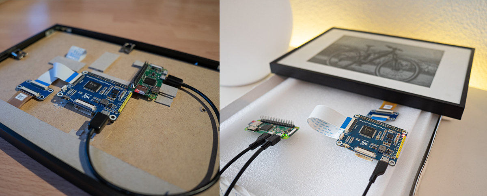

# IT8951 USB Treiber

Simpler USB-Treiber für ein IT8951 Kontroller. Getestet in diesem Fall mit einem E-Ink Display (10.3", 1872×1404) via USB an einem Raspberry Pi Zero W.

## Installation
Ausführbares File generieren
```
gcc main.c it8951.c -o it8951
```

## Parameter
Optionen:
*   Device: Pfad zum USB-Gerät z.B. /dev/sg0
*   -m: Mode: Waveform. Default = 2
*   -p: Pfad zu Datei
*   -d: Debug
*   -r: Devicerotation (0, 90°). Default = 0
*   -f: Fill: gewählte Bildfläche im Speicher mit Farbe 0-255 füllen
*   -l: Lade Input auf IT8951 Speicher
*   -i: Displayinformationen ausgeben
*   -s: IT8951 Speicher zeichnen
*   x y w h: Bildposition und Frösse
*   Input via Pipe, 8Bit-Graustufen Bild


## Beispiele
**Wichtig:** Das Programm muss als **root** ausgeführt werden!


Hilfe / Argumentübersicht
```
./it8951 -h
```

Farbfläche in den Speicher des IT8951 übertragen (Farbe 255 -> Weiss, Startpunkte x0,y0, Breite und Höhe 50px):
```
./it8951 -f 255 -s /dev/sg0 0 0 50 50
```

Anzeige eines Teilbildes aus dem Speicher (25x25px) auf dem Display. ( mit dem Waveform Mode 2)
```
./it8951 -s -m 2  /dev/sg0 0 0 25 25
```

Beispiel mit einem durch "ImageMagick" generierten Bild:
```
convert -background black -fill white -font Arial -pointsize 80 label:"123" -flip -gravity Center -extent 600x600 -depth 8 gray:- | ./it8951 -l -s -m 2 /dev/sg0 0 0 600 600
```

Ein .jpg anzeigen (via "ImageMagick")
```
convert test.jpg -resize 1872x1404\! -depth 8 gray:- | ./it8951  -m 2 -l -s /dev/sg0 0 0 1872 1404
```

Ein bereits konvertiertes Bild direkt laden und anzeigen
```
./it8951  -m 2 -l -s -p /root/test.raw /dev/sg0 0 0 1872 1404
```

## Materialliste
* Raspberry Pi Zero W
* Waveshare 10.3 Zoll E-Ink Display (inkl. IT8951 HAT)
* USB OTG Adapter (für die Verbindung zwischen Raspberry <> IT8951)

## Testaufbau
Der Aufbau besteht aus einem IT8951 gesteuerten Display und einem mittels USB (OTG USB-Adapter) verbunden Raspberry Pi Zero W. Verbaut werden diese schlussendlich in einem Bilderrahmen, wobi die einzelnen Komponenten direkt auf der Hinterseite verklebt worden sind (siehe Bild links).



## TODO
* Register schreiben / auslesen
* Image Buffer Index implementieren

## Dokumente
* Herstellerdokumentation  [> Link](https://www.waveshare.com/w/upload/c/c9/IT8951_USB_ProgrammingGuide_v.0.4_20161114.pdf)
* Herstellerdokumentation Waveforms [> Link](https://www.waveshare.net/w/upload/c/c4/E-paper-mode-declaration.pdf)
* Implementierung von Seagate (funktionierte bei mir jedoch nicht)  [> Link](https://github.com/Seagate/it8951/)


